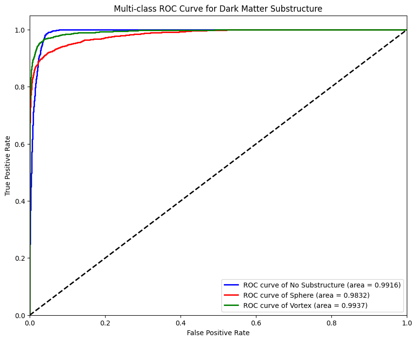
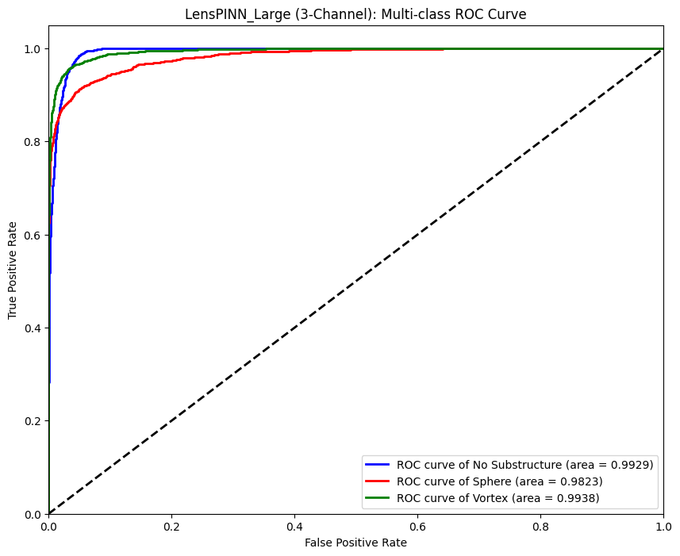

# 🌌 ML4SCI DeepLense: GSoC 2026 Evaluation Tests

**Applicant:** Nimesh Kavindu Rathnayake
**Organization:** Machine Learning for Science (ML4SCI)  
**Project:** DeepLense - Deep Learning for Strong Gravitational Lensing  

---

## 📌 Overview
This repository contains the official evaluation tasks submitted for the Google Summer of Code (GSoC) 2026 application for the ML4SCI DeepLense project. The objective is to classify simulated astrophysical matrices into three strong gravitational lensing categories: **No Substructure**, **Subhalo (Sphere)**, and **Vortex**. 

The implementation utilizes **PyTorch** to build custom, domain-adapted deep learning architectures, culminating in a highly innovative Physics-Informed Neural Network (PINN) that physically un-bends light using the gravitational lensing equation.

---

## 🚀 Results Summary

| Evaluation Task | Architecture | Validation Accuracy | F1-Score (Macro Avg) |
| :--- | :--- | :--- | :--- |
| **Common Test I** | Domain-Adapted ResNet-18 | **93.99%** | **0.94** |
| **Specific Test VII** | LensPINN_Large (EfficientNet-B0 + Physics Inversion) | **93.33%** | *0.94* |

*Note: While the standard ResNet-18 achieved a slightly higher peak validation accuracy, the LensPINN_Large architecture introduces a strict physical constraint that prevents the network from learning arbitrary pixel noise, ensuring the extracted features are scientifically valid representations of dark matter mass deflection.*

---

## 🔬 Methodology & Implementations

### Common Test I: Multi-Class Classification
**Notebook:** `Test_I_Multi_Class_Classification.ipynb`

Instead of relying on standard "black-box" transfer learning, this test focuses on manipulating tensor mathematics to perfectly fit the physical reality of the dataset.
* **1-Channel Native Ingestion:** Standard pre-trained models expect 3-channel (RGB) inputs. Rather than artificially duplicating the 1-channel `.npy` surface brightness matrices, the ResNet-18 `Conv1` layer was mathematically adapted. The original 3-channel weights were summed across the channel dimension, allowing the network to process the astrophysics data natively while retaining its pre-trained feature extraction capabilities.
* **Physics-Safe Augmentation:** To prevent overfitting on faint topological features, structural symmetries (random horizontal/vertical flips and 90-degree rotations) were dynamically applied via the PyTorch DataLoader.

#### Test I Evaluation
*(Add your ROC Curve and Confusion Matrix images here)*

---

### Specific Test VII: Physics-Guided ML (PINN)
**Notebook:** `Test_VII_Physics_Guided_ML.ipynb`

This test completely redesigns the classification pipeline by engineering `LensPINN_Large`, a tri-modular network that explicitly enforces the gravitational lensing equation: $\beta = \theta - \alpha(\theta)$.

* **The Gravity Estimator:** A dedicated CNN processes the raw images to predict the Einstein radius ($\theta_E$) caused by the macroscopic dark matter mass.
* **Physics Inversion Layer:** Using the estimated $\theta_E$, a custom mathematical grid-sampler calculates the deflection angle and physically un-bends the light, generating a reconstructed image of the source.
* **Log-Gradient Preprocessing:** The network isolates the incredibly faint substructures by creating a "Microscope" tensor, clamping the raw image and extracting the log-squared spatial gradients to map the physical bending of light.
* **Fusion Decoder (EfficientNet-B0):** The Raw Image, the Reconstructed Image, and the Preprocessed Gradient Map are concatenated into a 3-channel tensor. This fused representation is fed into an EfficientNet-B0 backbone, forcing the classifier to base its decisions on structural physics rather than standard pixel intensity.

#### Test VII Evaluation
*(Add your ROC Curve and Confusion Matrix images here)*

---
